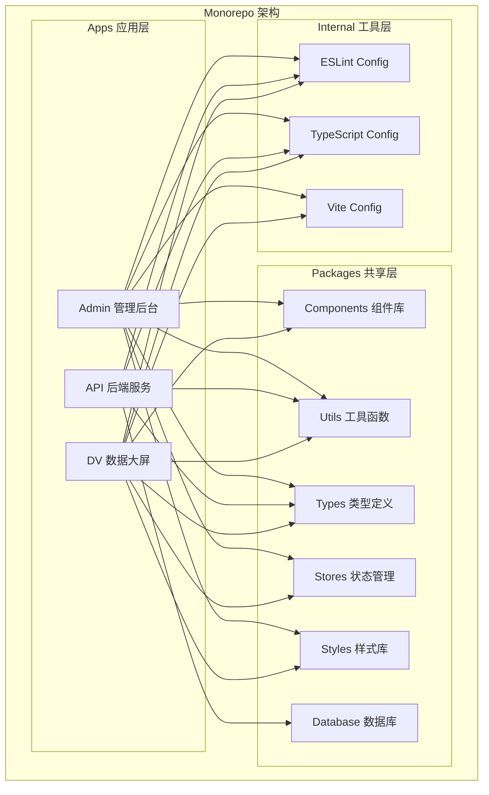
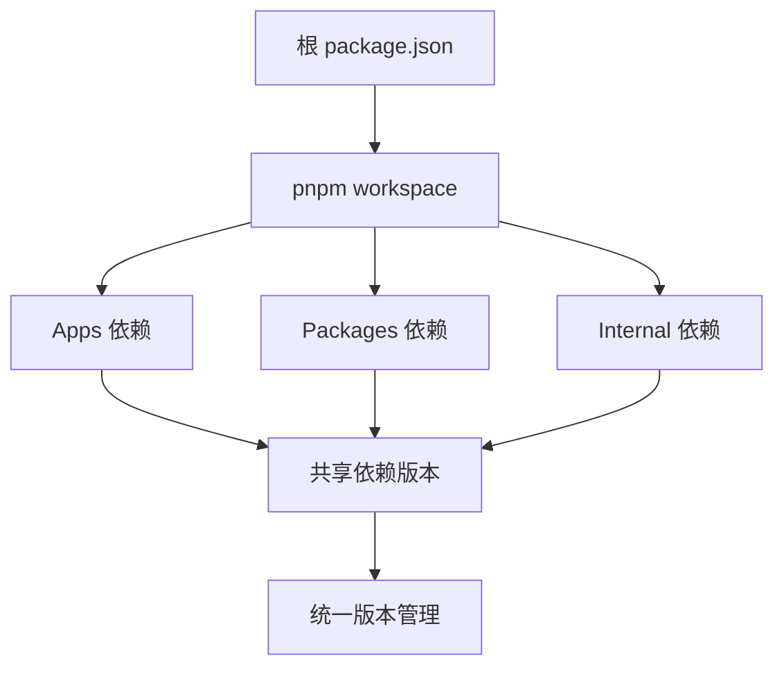

# 架构概览

Qiyun 前端开发模板采用现代化的 **Monorepo** 架构，旨在为企业提供统一、高效、可扩展的前端开发解决方案。

## 🏗️ 架构设计理念

### 核心原则

- **统一管理**: 在单一仓库中管理多个相关项目
- **代码复用**: 通过共享包实现代码和组件的复用
- **技术统一**: 统一的技术栈和开发规范
- **高效协作**: 简化团队协作和项目维护

### 解决的问题

::: danger 传统多仓库问题
- 🔄 **依赖管理复杂**: 多个仓库间依赖版本不一致
- 📦 **代码重复**: 相同功能在不同项目中重复开发
- 🔧 **工具链分散**: 每个项目都需要单独配置构建工具
- 👥 **协作困难**: 跨项目修改需要在多个仓库间切换
:::

::: tip Monorepo 优势
- ✅ **统一依赖**: 所有项目共享相同版本的依赖
- ✅ **代码复用**: 共享组件和工具函数
- ✅ **原子提交**: 跨项目修改可以在一次提交中完成
- ✅ **统一工具链**: 共享构建、测试、部署配置
:::

## 🎯 技术架构

### 整体架构图



### 技术栈选型

#### 🎨 前端技术栈

| 技术 | 版本 | 用途 | 选择理由 |
|------|------|------|----------|
| **Vue 3** | ^3.4.0 | 前端框架 | 组合式API，更好的TypeScript支持 |
| **TypeScript** | ^5.0.0 | 类型系统 | 提供类型安全，提升开发体验 |
| **Vite** | ^5.0.0 | 构建工具 | 快速的开发服务器和构建速度 |
| **Vue Router** | ^4.0.0 | 路由管理 | Vue 3 官方路由解决方案 |
| **Pinia** | ^2.1.0 | 状态管理 | 轻量级，更好的 TypeScript 支持 |
| **Ant Design Vue** | ^4.0.0 | UI组件库 | 企业级组件库，设计规范统一 |
| **TailwindCSS** | ^3.0.0 | CSS框架 | 原子化CSS，快速样式开发 |

#### 🔧 后端技术栈

| 技术 | 版本 | 用途 | 选择理由 |
|------|------|------|----------|
| **NestJS** | ^10.0.0 | 后端框架 | 模块化架构，装饰器语法 |
| **Prisma** | ^5.0.0 | ORM工具 | 类型安全的数据库操作 |
| **Redis** | ^7.0.0 | 缓存数据库 | 高性能缓存和会话存储 |
| **JWT** | ^9.0.0 | 身份认证 | 无状态认证方案 |
| **GraphQL** | ^16.0.0 | API查询语言 | 灵活的数据查询接口 |

#### 🛠️ 开发工具

| 工具 | 版本 | 用途 | 配置位置 |
|------|------|------|----------|
| **pnpm** | ^9.12.0 | 包管理器 | `pnpm-workspace.yaml` |
| **Turbo** | ^2.0.0 | 构建系统 | `turbo.json` |
| **ESLint** | ^8.0.0 | 代码检查 | `internal/eslint-config/` |
| **Prettier** | ^3.0.0 | 代码格式化 | `.prettierrc` |
| **VitePress** | ^1.0.0 | 文档生成 | `docs/.vitepress/` |

## 📁 目录结构详解

```
project-monorepo/
├── 📱 apps/                    # 应用项目目录
│   ├── admin/                 # 中台管理系统
│   │   ├── src/               # 源代码
│   │   ├── public/            # 静态资源
│   │   ├── package.json       # 项目配置
│   │   └── vite.config.ts     # 构建配置
│   ├── api/                   # 后端API服务
│   │   ├── src/               # 源代码
│   │   ├── libs/              # 自定义库
│   │   ├── test/              # 测试文件
│   │   └── package.json       # 项目配置
│   └── dv/                    # 数据可视化大屏
│       ├── src/               # 源代码
│       ├── public/            # 静态资源
│       └── package.json       # 项目配置
├── 📦 packages/               # 共享包目录
│   ├── components/            # 通用组件库
│   ├── constants/             # 常量定义
│   ├── database/              # 数据库配置
│   ├── effects/               # 特效组件
│   ├── stores/                # 状态管理
│   ├── styles/                # 样式库
│   ├── types/                 # 类型定义
│   └── utils/                 # 工具函数
├── 🛠️ internal/               # 内部工具目录
│   ├── eslint-config/         # ESLint配置
│   ├── pkg-utils/             # 包工具
│   ├── tsconfig/              # TypeScript配置
│   └── vite-config/           # Vite配置
├── 📚 docs/                   # 项目文档
│   ├── .vitepress/            # VitePress配置
│   ├── guide/                 # 开发指南
│   ├── architecture/          # 架构文档
│   ├── api/                   # API文档
│   └── components/            # 组件文档
├── 🔧 scripts/                # 构建脚本
├── 📄 package.json            # 根项目配置
├── 📄 pnpm-workspace.yaml     # pnpm工作空间配置
└── 📄 turbo.json              # Turbo构建配置
```

## 🔄 工作流程

### 开发流程


### 依赖管理



## 🚀 性能优化

### 构建优化

- **Turbo 缓存**: 智能缓存构建结果，避免重复构建
- **并行构建**: 多项目并行构建，提升构建速度
- **增量构建**: 只构建发生变化的项目和依赖

### 开发优化

- **热更新**: Vite 提供快速的热模块替换
- **类型检查**: TypeScript 提供编译时类型检查
- **代码分割**: 按需加载，减少初始包大小

## 🔒 安全考虑

### 代码安全

- **类型安全**: TypeScript 提供编译时类型检查
- **代码规范**: ESLint 规则防止常见安全问题
- **依赖检查**: 定期检查依赖包的安全漏洞

### 数据安全

- **JWT认证**: 无状态身份认证
- **权限控制**: 基于角色的访问控制
- **数据加密**: 敏感数据加密存储

## 📈 扩展性设计

### 水平扩展

- **微服务架构**: API 服务支持微服务拆分
- **负载均衡**: 支持多实例部署
- **缓存策略**: Redis 缓存提升性能

### 垂直扩展

- **插件系统**: 支持自定义插件扩展
- **主题系统**: 支持多主题切换
- **国际化**: 内置 i18n 支持

## 🔗 相关链接

- [Monorepo 结构详解](./monorepo.md)
- [技术栈详解](./tech-stack.md)
- [应用项目介绍](./apps.md)
- [共享包介绍](./packages.md)