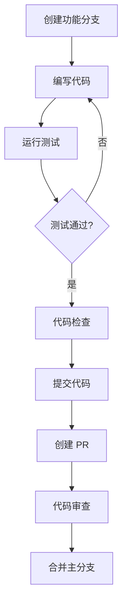

# 开发指南

本指南将帮助您快速上手 Qiyun 前端开发模板的开发工作，包括环境搭建、开发流程、代码规范等内容。

## 🚀 环境准备

### 系统要求

- **Node.js**: >= 18.0.0
- **pnpm**: >= 8.0.0 (推荐使用 pnpm 作为包管理器)
- **Git**: >= 2.20.0
- **数据库**: PostgreSQL >= 13.0 或 MySQL >= 8.0

### 开发工具推荐

- **IDE**: VS Code / WebStorm
- **浏览器**: Chrome >= 90 / Firefox >= 88
- **数据库工具**: DBeaver / Navicat
- **API 测试**: Postman / Insomnia

### VS Code 扩展推荐

```json
{
  "recommendations": [
    "vue.volar",
    "bradlc.vscode-tailwindcss",
    "esbenp.prettier-vscode",
    "dbaeumer.vscode-eslint",
    "ms-vscode.vscode-typescript-next",
    "prisma.prisma",
    "ms-vscode.vscode-json"
  ]
}
```

---

## 📦 项目初始化

### 1. 克隆项目

```bash
# 克隆项目
git clone <repository-url>
cd project-monorepo

# 查看项目结构
tree -I node_modules -L 2
```

### 2. 安装依赖

```bash
# 安装所有依赖（包括子项目）
pnpm install

# 验证安装
pnpm list --depth=0
```

### 3. 环境配置

```bash
# 复制环境配置文件
cp packages/database/.env-example packages/database/.env
cp apps/api/.env-example apps/api/.env

# 编辑数据库配置
vim packages/database/.env
```

### 4. 数据库初始化

```bash
# 生成 Prisma 客户端
pnpm db:generate

# 推送数据库结构
pnpm db:push

# 运行数据种子（可选）
pnpm db:seed
```

---

## 🛠️ 开发流程

### 启动开发环境

```bash
# 启动所有服务
pnpm dev

# 或者单独启动服务
pnpm dev:admin    # 启动管理后台 (http://localhost:5173)
pnpm dev:api      # 启动 API 服务 (http://localhost:3000)
pnpm dev:dv       # 启动数据可视化 (http://localhost:5174)
```

### 开发工作流



### 分支管理

```bash
# 创建功能分支
git checkout -b feature/user-management

# 开发完成后提交
git add .
git commit -m "feat: add user management module"

# 推送分支
git push origin feature/user-management
```

---

## 📝 代码规范

### 命名规范

#### 文件命名
- **组件文件**: PascalCase (如 `UserList.vue`)
- **工具文件**: camelCase (如 `formatDate.ts`)
- **常量文件**: SCREAMING_SNAKE_CASE (如 `API_ENDPOINTS.ts`)

#### 变量命名
```typescript
// ✅ 推荐
const userName = 'john'
const isUserActive = true
const userList = []

// ❌ 不推荐
const user_name = 'john'
const UserActive = true
const list = []
```

#### 函数命名
```typescript
// ✅ 推荐
function getUserById(id: string) {}
function handleUserClick() {}
function validateUserInput() {}

// ❌ 不推荐
function get_user() {}
function click() {}
function validate() {}
```

### TypeScript 规范

#### 类型定义
```typescript
// ✅ 推荐 - 使用接口定义对象类型
interface User {
  id: string
  name: string
  email: string
  createdAt: Date
}

// ✅ 推荐 - 使用联合类型
type Status = 'pending' | 'approved' | 'rejected'

// ✅ 推荐 - 使用泛型
interface ApiResponse<T> {
  data: T
  message: string
  code: number
}
```

#### 函数类型
```typescript
// ✅ 推荐 - 明确的参数和返回值类型
function createUser(userData: CreateUserDto): Promise<User> {
  // 实现
}

// ✅ 推荐 - 使用箭头函数类型
const handleClick: (event: MouseEvent) => void = (event) => {
  // 处理点击
}
```

### Vue 组件规范

#### 组件结构
```vue
<template>
  <!-- 模板内容 -->
</template>

<script setup lang="ts">
// 1. 导入
import { ref, computed, onMounted } from 'vue'
import type { User } from '@repo/types'

// 2. Props 定义
interface Props {
  userId: string
  showActions?: boolean
}
const props = withDefaults(defineProps<Props>(), {
  showActions: true
})

// 3. Emits 定义
interface Emits {
  update: [user: User]
  delete: [id: string]
}
const emit = defineEmits<Emits>()

// 4. 响应式数据
const user = ref<User | null>(null)
const loading = ref(false)

// 5. 计算属性
const displayName = computed(() => {
  return user.value?.name || '未知用户'
})

// 6. 方法
const fetchUser = async () => {
  loading.value = true
  try {
    // 获取用户数据
  } finally {
    loading.value = false
  }
}

// 7. 生命周期
onMounted(() => {
  fetchUser()
})
</script>

<style scoped>
/* 组件样式 */
</style>
```

#### 组件命名
```typescript
// ✅ 推荐 - 多词组件名
export default defineComponent({
  name: 'UserList'
})

// ✅ 推荐 - 基础组件前缀
export default defineComponent({
  name: 'BaseButton'
})

// ❌ 不推荐 - 单词组件名
export default defineComponent({
  name: 'User'
})
```

---

## 🧪 测试规范

### 单元测试

```typescript
// user.test.ts
import { describe, it, expect } from 'vitest'
import { formatUserName } from '../utils/user'

describe('formatUserName', () => {
  it('should format user name correctly', () => {
    const result = formatUserName('john', 'doe')
    expect(result).toBe('John Doe')
  })

  it('should handle empty names', () => {
    const result = formatUserName('', '')
    expect(result).toBe('Unknown User')
  })
})
```

### 组件测试

```typescript
// UserCard.test.ts
import { mount } from '@vue/test-utils'
import { describe, it, expect } from 'vitest'
import UserCard from '../UserCard.vue'

describe('UserCard', () => {
  it('should render user information', () => {
    const wrapper = mount(UserCard, {
      props: {
        user: {
          id: '1',
          name: 'John Doe',
          email: 'john@example.com'
        }
      }
    })

    expect(wrapper.text()).toContain('John Doe')
    expect(wrapper.text()).toContain('john@example.com')
  })
})
```

---

## 🎨 样式规范

### TailwindCSS 使用

```vue
<template>
  <!-- ✅ 推荐 - 使用语义化的类名组合 -->
  <div class="flex items-center justify-between p-4 bg-white rounded-lg shadow-md">
    <h2 class="text-lg font-semibold text-gray-900">标题</h2>
    <button class="px-4 py-2 text-white bg-blue-500 rounded hover:bg-blue-600 focus:outline-none focus:ring-2 focus:ring-blue-500">
      操作
    </button>
  </div>

  <!-- ❌ 不推荐 - 过长的类名 -->
  <div class="flex items-center justify-between p-4 bg-white rounded-lg shadow-md border border-gray-200 hover:shadow-lg transition-shadow duration-200">
    <!-- 内容 -->
  </div>
</template>
```

### CSS 变量使用

```css
/* ✅ 推荐 - 使用 CSS 变量 */
.custom-button {
  background-color: var(--color-primary);
  color: var(--color-white);
  border-radius: var(--border-radius-md);
}

/* ✅ 推荐 - 响应式设计 */
.responsive-grid {
  display: grid;
  grid-template-columns: repeat(auto-fit, minmax(300px, 1fr));
  gap: var(--spacing-4);
}
```

---

## 📡 API 开发规范

### RESTful API 设计

```typescript
// ✅ 推荐的 API 路由设计
GET    /api/users          # 获取用户列表
GET    /api/users/:id      # 获取单个用户
POST   /api/users          # 创建用户
PUT    /api/users/:id      # 更新用户
DELETE /api/users/:id      # 删除用户

// ✅ 推荐的响应格式
interface ApiResponse<T> {
  code: number
  message: string
  data: T
  timestamp: number
}
```

### 错误处理

```typescript
// ✅ 推荐的错误处理
try {
  const user = await userService.findById(id)
  return {
    code: 200,
    message: 'success',
    data: user,
    timestamp: Date.now()
  }
} catch (error) {
  if (error instanceof NotFoundError) {
    return {
      code: 404,
      message: '用户不存在',
      data: null,
      timestamp: Date.now()
    }
  }
  
  throw error
}
```

---

## 🔧 常用命令

### 项目管理

```bash
# 安装依赖
pnpm install

# 更新依赖
pnpm update

# 清理缓存
pnpm clean

# 构建项目
pnpm build

# 运行测试
pnpm test

# 代码检查
pnpm lint

# 代码格式化
pnpm format
```

### 数据库操作

```bash
# 生成 Prisma 客户端
pnpm db:generate

# 推送数据库结构
pnpm db:push

# 创建迁移
pnpm db:migrate

# 重置数据库
pnpm db:reset

# 查看数据库
pnpm db:studio
```

### Git 操作

```bash
# 查看状态
git status

# 添加文件
git add .

# 提交更改
git commit -m "feat: add new feature"

# 推送代码
git push origin feature-branch

# 拉取最新代码
git pull origin main
```

---

## 🐛 调试技巧

### 前端调试

```typescript
// ✅ 使用 console.log 进行调试
console.log('用户数据:', user)
console.table(userList)
console.group('API 调用')
console.log('请求参数:', params)
console.log('响应数据:', response)
console.groupEnd()

// ✅ 使用 Vue DevTools
// 在组件中添加调试信息
const debugInfo = computed(() => ({
  props: props,
  state: { user, loading },
  computed: { displayName }
}))
```

### 后端调试

```typescript
// ✅ 使用 Logger 进行调试
import { Logger } from '@nestjs/common'

@Controller('users')
export class UsersController {
  private readonly logger = new Logger(UsersController.name)

  @Get(':id')
  async findOne(@Param('id') id: string) {
    this.logger.log(`查找用户: ${id}`)
    
    try {
      const user = await this.usersService.findOne(id)
      this.logger.log(`找到用户: ${user.name}`)
      return user
    } catch (error) {
      this.logger.error(`查找用户失败: ${error.message}`)
      throw error
    }
  }
}
```

---

## 📚 学习资源

### 官方文档

- [Vue 3 官方文档](https://vuejs.org/)
- [NestJS 官方文档](https://nestjs.com/)
- [Prisma 官方文档](https://www.prisma.io/docs/)
- [TailwindCSS 官方文档](https://tailwindcss.com/)
- [Pinia 官方文档](https://pinia.vuejs.org/)

### 推荐教程

- [Vue 3 + TypeScript 最佳实践](https://vue3.dev/)
- [NestJS 实战教程](https://nestjs.bootcss.com/)
- [Prisma 数据库操作指南](https://prisma.yoga/)

### 社区资源

- [Vue 中文社区](https://vue3js.cn/)
- [NestJS 中文文档](https://nestjs.bootcss.com/)
- [前端开发规范](https://guide.aotu.io/)

---

## 🔗 相关文档

- [快速开始](./getting-started.md)
- [项目架构](../architecture/overview.md)
- [共享包详解](../architecture/packages.md)
- [应用项目详解](../architecture/apps.md)